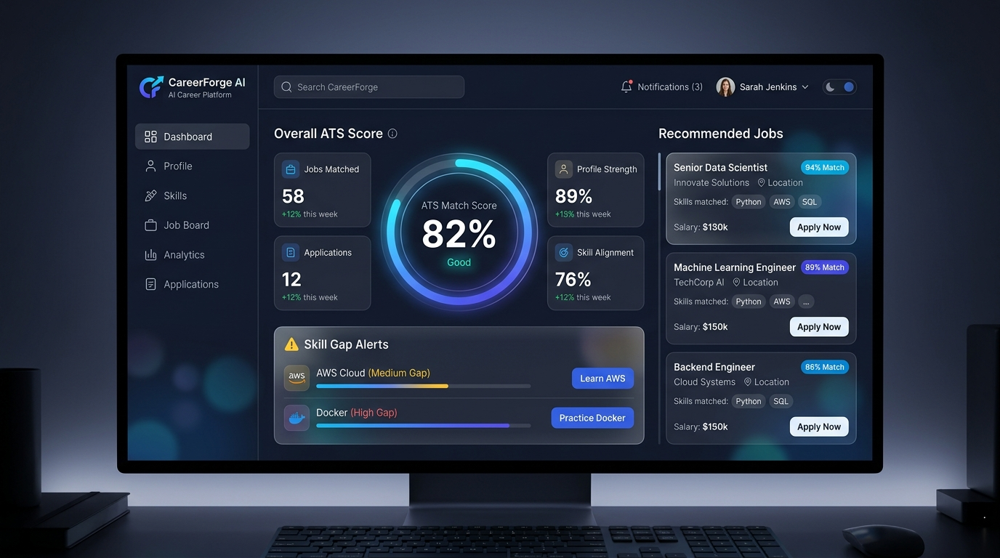
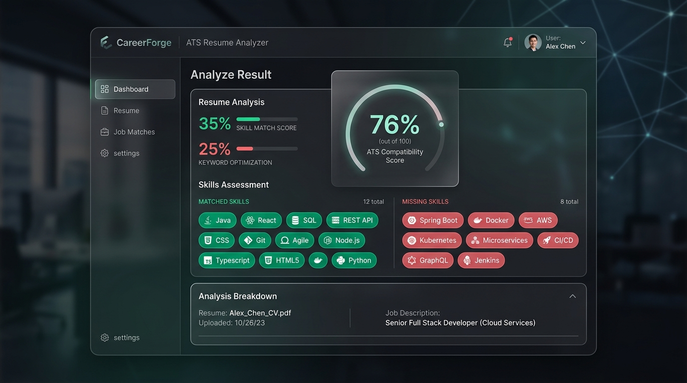
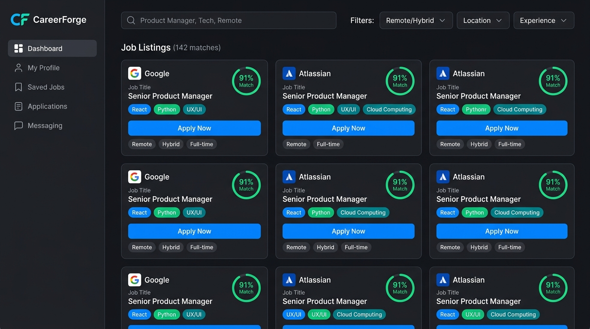

# 🚀 CareerForge — AI Career & ATS Optimization Platform

[](https://careerforge-93bs.onrender.com)
[](https://github.com/Hemant-Sharma-22/CareerForge)
[](LICENSE)

> **Don't just check your resume. Improve it, optimize it for the job, discover real tech opportunities, and manage your job application pipeline — all from one intelligent SaaS platform.**

---

## 🌐 Live Production Demo
👉 **[https://careerforge-93bs.onrender.com](https://careerforge-93bs.onrender.com)**

---

## 🌟 Visual Platform Previews

### 1. Executive Career Control Center & Analytics


### 2. Explainable ATS Scoring & Skill Gap Detector


### 3. Multi-Source Live Job Discovery Engine


---

## 🔑 Key Features & Highlights

- 🎯 **Explainable ATS Scoring Engine**: 6-tier transparent weighted evaluation model (Skill Match, Keyword Density, Experience Tenure, Education, Completeness, Formatting).
- 🤖 **Groq AI Resume Enhancer**: Instant AI bullet point generation and resume tailoring powered by Groq's high-speed LLM (`llama-3.3-70b-versatile`).
- ⚡ **Multi-Source Live Job Aggregator**: Aggregates live software engineering opportunities across **6 job platforms** (*Naukri, Instahyre, Remotive, Arbeitnow, Jobicy, Internshala*) with automated daily caching and instant force refresh.
- 🔐 **Google OAuth 2.0 & JWT Security**: 1-tap Google Sign-In with real Gmail capturing and JWT session token protection.
- 📋 **Kanban Application Funnel & Reminders**: Interactive application stage tracker with job bookmarking and reminder alerts.
- 🎨 **ChatGPT Dark Charcoal Design System**: Sleek human-centered SaaS UI with collapsible sidebar workspace controls.

---

## 🔄 End-to-End Career Workflow

```text
RESUME UPLOAD (PDF / DOCX)
   ↓
PARSING & SECTION SEGMENTATION
   ↓
EXPLAINABLE ATS RULE SCORING (6-Tier Weights)
   ↓
SKILL GAP & KEYWORD DETECTION
   ↓
GROQ AI BULLET OPTIMIZATION & RESUME BUILDER
   ↓
MULTI-SOURCE JOB AGGREGATION & MATCH SCORING
   ↓
DIRECT EMPLOYER APPLICATION
   ↓
KANBAN APPLICATION FUNNEL & SAVED REMINDERS
   ↓
ANALYTICS & SCORE PROGRESS TRENDS
```

---

## 🛠️ Technology Stack

### Frontend
- **Framework**: React.js 18 + Vite
- **Styling**: Tailwind CSS + Custom Dark Charcoal Theme (`#171717` / `#212121`)
- **Icons & Data Viz**: Lucide React + Recharts
- **State & Auth**: React Context API (`AuthContext`)

### Backend
- **Runtime**: Node.js + Express.js
- **Database & ORM**: PostgreSQL + Prisma ORM (with in-memory fallback)
- **AI Engine**: Groq SDK (`llama-3.3-70b-versatile`)
- **File Processing**: Multer + `pdf-parse` + `mammoth` (PDF/DOCX)
- **Authentication**: Google OAuth 2.0 (Identity Services) + JWT + `bcryptjs`
- **API Docs**: OpenAPI / Swagger UI (`/api-docs`)

---

## 📊 Explainable ATS Scoring Math

CareerForge uses a 100% explainable, transparent ATS evaluation formula:

$$\text{Final ATS Score} = (0.35 \times \text{Skill}) + (0.25 \times \text{Keyword}) + (0.15 \times \text{Experience}) + (0.10 \times \text{Education}) + (0.10 \times \text{Completeness}) + (0.05 \times \text{Formatting})$$

| Component | Weight | Description |
| :--- | :---: | :--- |
| **Skill Match** | 35% | Direct match ratio between candidate skills and JD required/preferred skills |
| **Keyword Match** | 25% | Presence of target terminology and action keywords in resume body |
| **Experience Match** | 15% | Required experience years vs candidate tenure in roles |
| **Education Match** | 10% | Presence of required degree qualifications (B.Tech, B.S., M.S.) |
| **Completeness** | 10% | Completeness of Summary, Experience, Skills, Education, Projects sections |
| **Formatting** | 5% | Structural length, section headers, and text clarity |

---

## ⚡ Quick Start Guide (Local Setup)

### 1. Clone & Environment Configuration

```bash
git clone https://github.com/Hemant-Sharma-22/CareerForge.git
cd CareerForge
```

Create a `.env` file in the root directory:
```env
PORT=5000
NODE_ENV=development
JWT_SECRET=careerforge_super_secret_jwt_key_2026
GROQ_API_KEY=gsk_your_groq_api_key
VITE_GOOGLE_CLIENT_ID=669722402174-a8ktjadpkkjsll6k3hsbq8h47duouqhb.apps.googleusercontent.com
```

### 2. Install Dependencies & Build

```bash
# Install root dependencies
npm install

# Generate Prisma Schema
npm run prisma:generate

# Run Full-Stack Development Mode
npm run dev:server
npm run dev:client
```

Visit the application at `http://localhost:3000`.

---

## 🚀 Render Cloud Deployment

CareerForge is pre-configured for 1-click Render deployment via [`render.yaml`](./render.yaml):

1. Connect repository to [Render Dashboard](https://dashboard.render.com/).
2. Set **Build Command**: `npm install --include=dev && npm run build`
3. Set **Start Command**: `npm start`
4. Configure environment variables (`GROQ_API_KEY`, `JWT_SECRET`, `VITE_GOOGLE_CLIENT_ID`).

---

## 📖 API Documentation (Swagger)

All REST endpoints are documented with OpenAPI / Swagger UI:
Access locally at: `http://localhost:5000/api-docs`

---

## 🧪 Automated Testing

Run the automated ATS scoring engine unit test suite:

```bash
npm test
```

---

## 📜 License & Ethics

- **License**: MIT License
- **No Fake Data Guarantee**: CareerForge never fabricates credentials or skills not present in the candidate's authentic profile.
- **Direct Employer Links**: Directs candidates to authentic employer portal endpoints.
